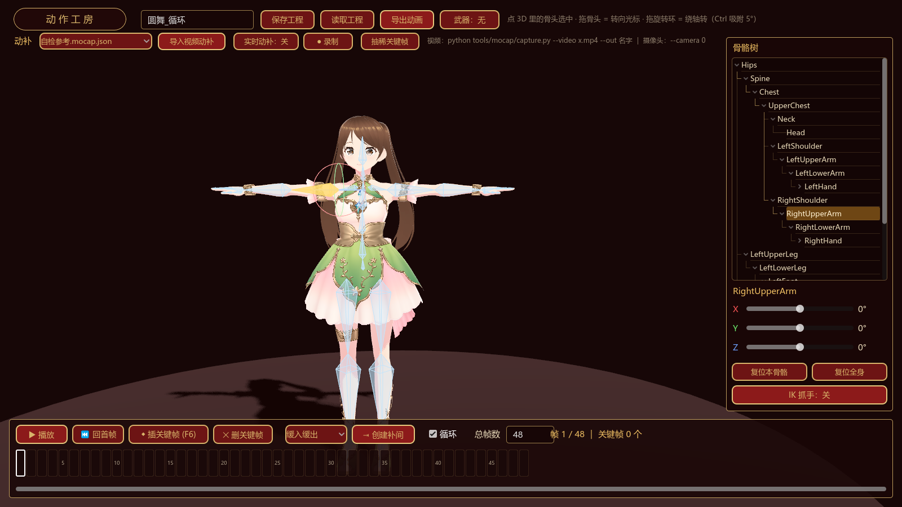
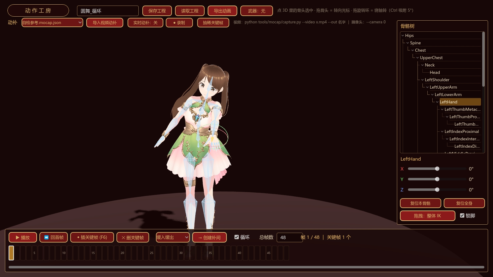
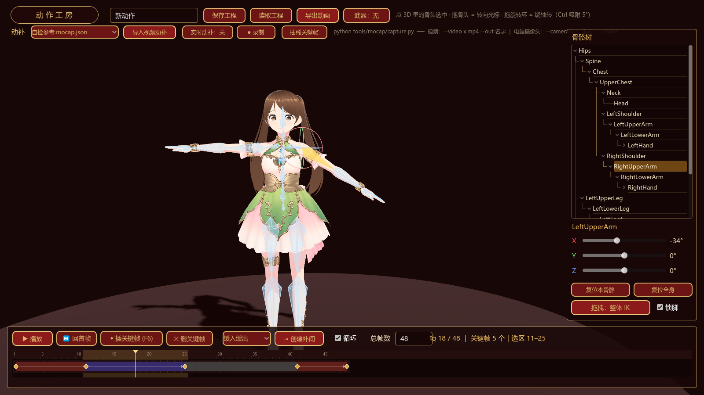
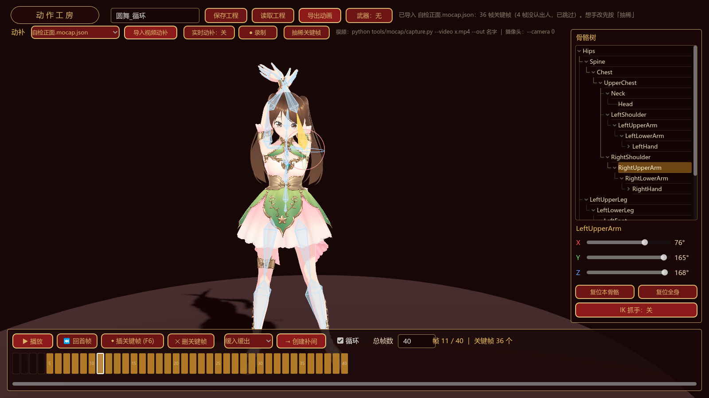

# VRM Motion Gen — 动作工房

给 VRM / VRoid 模型做动作的独立编辑器。Godot 4.6 + GDScript，UI 全代码构建。

**三种做动作的方式，可以混着用：**

- 🖐 **全身 IK 摆姿势** — 像 Cascadeur 那样，拖一只手，小臂、大臂、肩、脊柱、胯全跟着动。
- 🎬 **关键帧 + 缓动补间** — Flash/Animate 式：选两帧，一键补间，五种缓动曲线。
- 📹 **动补** — 视频文件离线跑，或摄像头实时跟随录制。身体 + 十指 + 表情一起捕。

导出 `.tres`（Godot `Animation` 资源），拖进任何 Godot 项目就能播。



---

## 快速开始

```bash
git clone <this-repo>
cd vrm-motion-gen
godot --headless --path . --import   # 首次：重建导入缓存（VRM 有 17MB，要等一会）
godot --path .                       # 开工
```

需要 [Godot 4.6+](https://godotengine.org/)（标准版即可，不用 .NET 版）。主场景是 `scenes/anim_studio.tscn`。

动补是可选的，要用再装：

```bash
pip install -r tools/mocap/requirements.txt   # mediapipe + opencv
```

模型权重（13MB）首次运行 `capture.py` 时自动下载，不用手动准备。

> ⚠️ **预览模型 `avatars/avatar0.vrm` 是 CC-BY / 仅限个人非商用**，不得用于暴力或性表现。
> 要商用请换成你自己的模型（改 `scripts/anim_studio.gd` 顶部的 `AVATAR` 常量即可）。
> 工具代码本身是 MIT，不限制商用。详见 [CREDITS.md](CREDITS.md)。

---

## 全身 IK：拖一只手，全身跟着动



在 3D 里点中任意骨头，按住左键拖 —— **从胯到这根骨头的整条链一起解**。手臂先伸，够不着才弯腰拧腰，
双脚锁在原地不打滑。拖 `Hips` = 整个人平移（挪重心）。

| 操作 | 效果 |
|---|---|
| 左键拖骨头 | 整体 IK（默认）。骨头在「面向相机的平面」内动，转视角就能补另一个自由度 |
| 左键拖旋转环 | 绕单轴精确旋转（选中骨头后关节处出现红/绿/蓝三个环），按 **Ctrl** 吸附 5° |
| 右键拖 / 滚轮 / 中键拖 | 转视角 / 缩放 / 平移 |
| 右侧面板切「单骨 FK」 | 只转被拖的那一根，别的一动不动 |

可摆 **52 根人形骨**：脊柱、头颈、双臂双手 + 十指三节、双腿双脚。裙摆/头发那些 SpringBone
摇物骨不进编辑器（交给物理，手 K 会跟物理打架）。

<details>
<summary><b>它是怎么做到「像人」而不是「像橡皮」的</b></summary>

解法是 **FABRIK**：把骨链当成一串定长线段，反复「从末端往回拉一遍、再从根往外推一遍」。
选它不选雅可比迭代，是因为它不用求导、手臂完全伸直（奇异位形）也不会炸，而且每次迭代都
还原骨长 —— **骨头绝不会被拉长**，这在动画工具里是硬要求。

但光有 FABRIK 只会得到一根橡皮人。让它像人的是另外两件事：

1. **分两级解**：先只解肢体（大臂→手），躯干纹丝不动；一级够不着，才把脊柱和胯拉进链里。
   这就是人的行为顺序 —— 先伸手，够不着才弯腰。附赠一个好性质：手边的小调整绝对不会把
   整个身子带得东倒西歪。
2. **关节限位**：躯干每一节最多让多少度（胯 14°、脊柱 20°、胸 16°、上胸 12°、锁骨 22°）。
   没有限位的话，脚一锁死、目标一放远，FABRIK 会把脊柱直接对折过去、头埋进胸口 ——
   数学上没错，人体上荒谬。限位之后躯干让到极限就不让了，**剩下的够不着就是够不着**。

自检（`tools/test_bodyik.gd`）钉死了四条硬指标：

| | 实测 |
|---|---|
| 够得到（目标在可达范围内） | 末端误差 **1.4 mm** |
| 骨头不许被拉长 | **0.000 mm**（够不着时只是伸直，也不拉长） |
| 脚不许打滑 | 弯腰拧腰后双脚漂移 **1.4 / 0.9 mm** |
| 躯干不许扭成麻花 | 每一节都不超关节限位 |

</details>

---

## 关键帧 + 缓动补间



底部是一个真正的时间轴（自绘 Control，不是一排按钮），30fps，最多 240 帧。

| 操作 | 效果 |
|---|---|
| **拖标尺** | 拖着播放头擦帧（scrub），实时看姿势，松手不落关键帧 |
| **拖关键帧** | 把它挪到别的帧 —— 它的补间、表情、胯位移会一起搬过去 |
| **在帧格里拖** | 拉出区间选择（「创建补间」用的就是这个选区） |
| **Shift + 点击** | 把选区拉到这一帧 |
| **右键** | 弹菜单：插入 / 删除关键帧、创建 / 清除补间 |
| **Ctrl + 滚轮** | 缩放帧宽（光标底下那一帧钉住不动）；普通滚轮 = 左右平移 |
| **F6** | 把当前**整身姿势**记成关键帧。拖骨头松手、调滑条也会自动落 |

画法跟 Animate 一致：**关键帧 = 实心金圆点**，两个关键帧之间的**补间画成带箭头的色带** ——
暗红 = 线性，蓝紫 = 缓动（缓入/缓出/缓入缓出），灰 = 定格（没有箭头，因为它不渐变）。

---

## 动补（视频 / 摄像头）



姿态估计跑在 Python 边车里（Godot 没有 ML 推理），Godot 只负责把关键点重定向成骨骼旋转。
一次推理同时拿到**身体 33 点 + 双手各 21 点 + 面部 ARKit 52 blendshape**。

**离线（视频文件）** —— 慢、准、可重跑：

```bash
python tools/mocap/capture.py --video dance.mp4 --out 圆舞
```
→ 写出 `animations/mocap/圆舞.mocap.json`。回编辑器点「导入视频动补」。

**实时（电脑摄像头）** —— 模型实时跟着你动：

```bash
python tools/mocap/capture.py --camera 0
```
→ 关键点用 UDP 喷到 `127.0.0.1:9977`。编辑器点「实时动补：开」接收，再点「● 录制」录成关键帧。

**实时（手机摄像头）** —— 不用装任何 App：

```bash
python tools/mocap/capture.py --phone
```
→ 打印一个 `https://<你电脑的局域网IP>:8443`。手机（同一个 Wi-Fi）用浏览器打开，点「开始」授权摄像头，
画面就以 JPEG 帧经 WebSocket 传回电脑。**识别在电脑上跑，手机只当摄像头**，所以老手机也不卡。
手机架远一点更容易全身入镜，比笔记本的摄像头好用得多。

> 手机上会跳一次「连接不是私密连接」的警告，点「高级 → 继续前往」。这是**必须**的：浏览器的摄像头权限
> 只在 HTTPS（安全上下文）下才给，纯 HTTP 的局域网页面会被直接拒掉、连弹窗都不会有。所以程序会现签
> 一张只在你局域网里用的自签证书（存在 `tools/mocap/.cert/`，已 gitignore，私钥不进仓库）。

手机上已经装了 DroidCam / IP Webcam 之类的推流 App，也可以直接喂流地址（RTSP 同理）：

```bash
python tools/mocap/capture.py --url http://192.168.1.7:8080/video
```

**录完先按「抽稀关键帧」。** 动补给的是逐帧关键帧，时间轴糊成一整片金色，人手根本改不动；
抽稀只在姿势转折处留关键帧、中间交给补间，之后就能像手 K 的动作一样修了。

### 动补的实际精度（别抱不切实际的期待）

让模型自己演一段**已知**动作 → 渲染成视频 → 捕回来 → 跟真值逐骨比对（`tools/test_mocap.gd`）：

| 量的是什么 | 结果 |
|---|---|
| 重定向本身（骨头有没有精确扭到关键点指的方向） | **0.0000°** |
| MediaPipe 的图像平面精度（X/Y） | 四肢平均 **12.7°** |
| MediaPipe 的深度精度（加上 Z） | 四肢平均 **27.6°** |
| 手臂绕身 / 往身后甩的动作 | 四肢平均 **52.8°** |

**轮廓抓得准，前后深度是糊的** —— 单目姿态估计的固有软肋，不是重定向的锅。所以：
拍的时候**尽量正对镜头、别让肢体前后穿插**；捕回来当**草稿**，转折帧手工修。

（这组数字还是拿动漫模型的渲染视频量的 —— 白袖子白手套、动漫脸，是最难的情况。真人视频会好一些。）

---

## 导出

- **保存/读取工程** → `animations/custom/<名>.pose.json`（关键帧 + 缓动区间 + 表情 + 胯位移，可反复改）
- **导出动画** → `animations/custom/<名>.tres`，一个标准的 Godot `Animation`：
  - 骨骼：`rotation_3d` 轨道，路径 `%GeneralSkeleton:骨骼名`
  - 表情：`blend_shape` 轨道，路径 `%GeneralSkeleton/Face:形变名`
  - 胯位移：`position_3d` 轨道（**只有拖过胯才会生成** —— 生成了会盖掉游戏里角色自己的位移）

拖进任何有 VRM 骨架的 Godot 项目，挂到 `AnimationPlayer` 上就能播。

---

## 结构

```
scenes/anim_studio.tscn      主场景（6 行，UI 全在脚本里搭）
scripts/
  anim_studio.gd             编辑器本体：舞台 / 骨骼树 / 时间轴 / 全部交互
  body_ik.gd                 全身 IK：FABRIK + 分级解 + 关节限位 + 锁脚
  pose_solver.gd             正向运动学 / 瞄准求解器（全身 IK 和动补共用）
  mocap.gd                   动补重定向：MediaPipe 关键点 → 骨骼旋转 + 表情形变
  bone_overlay.gd            骨骼可视化（穿透模型的八面体骨头）+ 鼠标拾取 + 旋转环
  anim_baker.gd              补间采样、抽稀、烘焙导出、工程存读
  humanoid_bones.gd          人形骨骼解析（名字优先、拓扑兜底）、骨头尖向量
tools/
  mocap/capture.py           动补采集端（视频 / 摄像头 → JSON / UDP）
  test_*.gd                  自检（见下）
```

## 自检

```bash
godot --headless --path . --script res://tools/test_studio.gd    # 缓动/烘焙/骨架拓扑/瞄准公式
godot --headless --path . --script res://tools/test_bodyik.gd    # 全身 IK 的四条硬指标
godot --headless --path . --script res://tools/test_mocap.gd     # 动补重定向 vs 真值
godot --path . --script res://tools/test_flow.gd                 # 端到端：拾取→拖骨头→补间→导出
godot --path . --script res://tools/test_mocap_flow.gd           # 端到端：导入动补→抽稀→导出→真播

# 手机动补的链路自检（一个终端跑 capture.py --phone，另一个跑这个；不用真手机）
python tools/mocap/test_phone.py
```

换模型时先看骨架长什么样：

```bash
godot --headless --path . --script res://tools/dump_bones.gd     # 骨骼层级
godot --headless --path . --script res://tools/dump_shapes.gd    # 表情形变名
godot --headless --path . --script res://tools/dump_meta.gd      # VRM 授权条款
```

---

## 踩过的坑

写给下一个碰同样问题的人。

- **`Skeleton3D` 的全局姿态缓存要等场景循环转起来才刷新。** 在 `SceneTree._initialize()` 里 `set_bone_pose_rotation` 之后马上 `get_bone_global_pose`，读回来的还是旧值（`force_update_all_bone_transforms()` 也救不了）；在 `_process` 里同帧读写就完全正常。测试脚本必须跑在 `_process` 里 —— 第一版测试栽在这上面，误报了一个 64° 的「瞄准 bug」，其实公式一直是对的。

- **别假设「骨骼局部 +Y 就是骨头方向」。** VRoid 骨架大部分骨骼确实如此，但小腿→脚差 2.5cm（脚往前挪了一截）。`bone_tips()` 直接取子骨骼的 rest 偏移向量，骨头才画得准、拖拽瞄准才不偏。

- **全身 IK 的「刚度」不能靠「每次迭代往原始姿势拉回去」实现。** 第一版这么写，躯干被彻底焊死 —— 每轮都拉回原点，偏移根本累积不起来（实测脊柱转了 0.0°）。换成**分两级解**才对，而且更符合直觉。

- **拖肢体的根骨（大臂/大腿）必须走纯 FK。** 单根骨头的尖只能落在半径 = 骨长的球面上，目标基本永远「够不着」；要是也走「够不着就升级到全身链」，拖个大臂都会带着全身晃。

- **锁骨不能进肢体链。** 它既是躯干限位骨、又是手臂链的第一根，一旦进了肢体链，最后那次「拿限位后的躯干重解肢体」就会把它的限位覆盖掉 —— 锁骨能甩出 80°。

- **动补丢帧时要保持上一帧，不能弹回静止姿态。** 手部检测时有时无，一丢帧十根手指就「啪」地摊回 T-pose：实时预览里手指一直抽搐，而且这个每帧几十度的抖动会把抽稀彻底废掉（误差永远超阈值，一帧也删不掉）。

- **校验动补不能直接比四元数。** 骨头绕自身轴的自转是单目动补根本测不出来的自由度，拿四元数算误差会把好结果冤枉成 100°+。要比**骨头指向**。

- **抽稀阈值压不到噪声地板以下。** 动补数据本身有 5~10° 的逐帧噪声，阈值定太小的话每一帧都被判成「转折点」，一帧也删不掉。所以默认 8°。

- **Godot 的 `rotation_3d` 轨道两个关键帧之间只会匀速 slerp**，缓动曲线喂不进去。所以缓动/定格区间只能逐帧烘死；线性区间才只留两个端点。

- **表情轨道某一帧没登记 = 那一帧是 0，不能跳过。** 跳过的话轨道会把前后两个非零关键帧直接连起来，表情永远消不掉。

- **`MeshInstance3D` 自带 `skeleton` 属性（NodePath）**，子类里再定义同名成员会解析报错。骨骼线框那个 overlay 也是 `MeshInstance3D`，找表情网格时要按 `is ArrayMesh` 过滤掉它（`ImmediateMesh` 没有 `get_blend_shape_count`）。

- **`mediapipe` 0.10.35 已经移除了旧的 `mp.solutions` API**，要用 Tasks API 的 `vision.HolisticLandmarker` —— 好在它一次推理就给全身体 + 双手 + 表情 blendshape。

- 骨骼拾取全在**屏幕空间**做（把骨段/圆环投影成 2D 折线算像素距离），不用 Area3D + 物理射线：骨骼每帧都在动，同步碰撞体的代价和坑都更大，而且「离光标几个像素」正好就是用户眼里的「点没点中」。

---

## 授权

代码 [MIT](LICENSE)。**预览模型和插件另有条款，见 [CREDITS.md](CREDITS.md)** —— 尤其是想商用的话。
